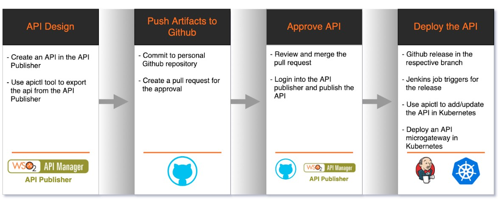

## API Operator for Kubernetes Demo Artifacts

### Prerequisits

- CI/CD Server (Jenkins)
- Version control system (GitHub)
- API Operator [v1.1.0 distribution](https://github.com/wso2/k8s-api-operator/releases/download/v1.1.0/k8s-api-operator-1.1.0.zip)
- API Controller [v3.1.0](https://wso2.com/api-management/tooling/) (CLI distribution)
- API Manager installed

### CI/CD Flow



### Configure Jenkins

Copy the bash scripts in jenkins-resources/ to a location in Jenkins.

Make sure they can be accessed by the Jenkins user.

### Configure build job - Multibranch pipeline

Go to Jenkins *New Item -> Multibranch Pipeline -> Create*

- Configure the GitHub repository that the APIs should be fetched from.

### GitHub repository

Create a GitHub repository to maintain the APIs.
Create seperate branches for the APIs that you want to deploy.

- products-api
- onlinestore-api

Go to the repository settings and create a GitHub webhook for *push* events by pointing to the Jenkins server.

Cope the *Jenkinsfile* in jenkins-resources/Jenkinsfile and place it under every branch that you are creating for APIs.

Note: In each branch, you have to change the following varibles.

- APINAME: branch name
- REPO: The repository APIs are being fetched (org/repo format)
- you may find placeholders to mention the paths to bash scripts we places in Jenkins machine in previous step. Make sure to give correct paths to those bashfiles within the *Jenkinsfile*


### Setup API Manager and Analytics portal

Use the introductions mention in [this document](https://github.com/pubudu538/api-operator-demo/tree/master/wso2apim-with-analytics) to install API Manager with analytics in the Kubernetes cluster.


### Install API Operator

Install the API Operator on your kubernetes cluster by using the operator resources in this repository.

```
apictl install -f /k8s-api-operator-1.1.0/api-operator/controller-artifacts
```

Once you execute the above command, you would be prompted to enter docker registry details etc. Make sure to configure it properly.

Configure the analytics.

```
apictl apply -f ./k8s-api-operator-1.1.0/api-operator/apim-analytics-configs/
```

### Configure API Controller (apictl tool)

Download the API Controller from the website.
Extract and set the executable's location to the PATH variable to access *apictl* from anywhere.

### CI/CD pipeline scenario

Add the deployed API Manager deployment as an envrionment.

```
apictl add-env -e k8s --apim https://wso2apim:32001 --token https://wso2apim:32001/oauth2/token
```

Create products-api in API publisher (<https://wso2apim:32001/publisher)> with following information.

- API Name : products-api
- Context: prod
- Version: v1.0
- Endpoint: <http://products-ep>
- Resource:
  - GET /products

Export products-api

```
apictl export-api --name products-api --version v1.0 -e k8s -k
```

- You will get a zipped artifacts of the API.
Unzip that in to the location where you have cloned yout GitHub repository.
- Commit it to get it merged with the remote repository.
- This will create a GitHub tab to mark the revision and deploy the API on Kubernetes using API Operator.
  
### Verify API deployment on Kubernetes cluster

List the runing pods on Kubernetes cluster.
If you see a pod with {API-NAME}-kaniko-xxxx , then the API is being created.
```
NAME                          READY   STATUS      RESTARTS   AGE
products-api-kaniko-qh9p8     1/1     Running     0          20s
```
After a while above pod's status will be "COMPLETED". And you will see the products-api pod is up and running.

```
NAME                          READY   STATUS      RESTARTS   AGE
products-api-xxxxxxx-xxxx     1/1     Running     0          20s
```

Now the API has been deployed with the ingress resources.

### Check ingress resources

```
kubectl get ingress

NAME                                   HOSTS                  ADDRESS        PORTS     AGE
api-operator-ingress-products-api      mgw.ingress.wso2.com   xx.xxx.xx.xxx   80, 443   6h24m

```


### Invoking URLS

Log in to the publisher portal(<https://wso2apim:32001/publisher)> and publish the API by chaing its life cycle state.

Go to the API manager developer portal (<https://wso2apim:32001/devportal)>

Create an application.

Subscribe products-api to that application & generate an access token.

Then use the received token in the following command to invoke the API.

```
curl -H "Host:mgw.ingress.wso2.com" https://xx.xx.xx.xx/prod/v1.0/products -H "Authorization:Bearer $TOKEN" -k

{"products":[{"name":"Apples", "id":101, "price":"$1.49 / lb"}, {"name":"Macaroni & Cheese", "id":151, "price":"$7.69"}, {"name":"ABC Smart TV", "id":301, "price":"$399.99"}, {"name":"Motor Oil", "id":401, "price":"$22.88"}, {"name":"Floral Sleeveless Blouse", "id":501, "price":"$21.50"}]}
```


 


  

 